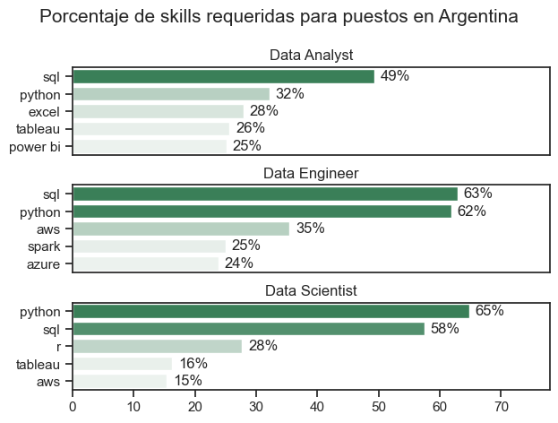
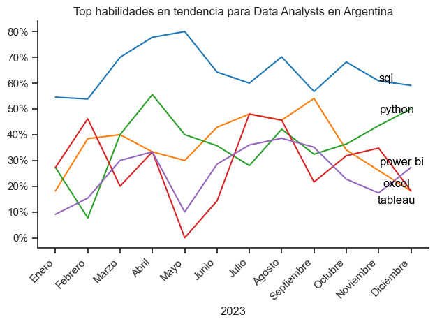

# Introducción
En mi carrera de Analista de Sistemas (Instituto ORT) cursé Programación 3, materia en la cual nos dieron un pantallazo general del mundo del análisis de datos, tanto desde la teoría como ejercicios prácticos en R Studio.

A partir de mi interés y curiosidad por orientar mi desarrollo profesional hacia el análisis de datos, realicé el presente proyecto en base al curso de Luke Barousse para familiarizarme con Juypter Notebooks y aprender a utilizar las diferentes librerías de Python para el análisis.

Recursos de Luke Barousse utilizados:
- YouTube ["Python for Data Analytics"](https://www.youtube.com/watch?v=wUSDVGivd-8&t=27689s)
- GitHub ["Python_Data_Analytics_Course"](https://github.com/lukebarousse/Python_Data_Analytics_Course)

# Resumen
El siguiente proyecto tiene como propósito analizar el mercado laboral para puestos relacionados al área de Data, haciendo énfasis en los roles de Data Analyst (Análisis de Datos). 

## Preguntas para el análisis
Este proyecto se propone indagar sobre:
1. ¿Cuáles son las habilidades (skills) mayor demandadas para los tres puestos más populares en el campo de Data?
2. ¿Cuál es la tendencia de las habilidades más demandadas para los Data Analysts?

# Herramientas
El análisis se desarrolló con las siguientes herramientas:
- **Python** y las siguientes librerías:
    - **Pandas:** para analizar los datos.
    - **Matplotlib:** para visualizar los datos.
    - **Seaborn:** para crear visualizaciones más detalladas.
- **Jupyter Notebooks:** herramienta donde ejecuté el código de Python. Permite dividir el código por secciones, incluir comentarios y gráficos, haciendo más amigable la lectura del código e interpretación del análisis.
- **Visual Studio Code:** IDE (entorno de desarrollo integrado) para ejecutar el código.
- **Git & GitHub:** para el control de versiones y compartir mi proyecto.

# Preparación y limpieza de los datos
## Importar librerías
```python
import ast 
import pandas as pd
import seaborn as sns
import matplotlib.pyplot as plt
from datasets import load_dataset
```
## Cargar el dataset
El dataset se carga mediante la función load_dataset de la librería datasets, ya que está almacenado en Hugging Face.
```python
dataset = load_dataset('lukebarousse/data_jobs')
df = dataset['train'].to_pandas()
```

## Limpieza de datos
La columna job_posted_date se convierte a tipo de dato datetime, y la columna job_skills se convierte de string a una lista.
```python
df['job_posted_date'] = pd.to_datetime(df['job_posted_date'])

df['job_skills'] = df['job_skills'].apply(lambda x: ast.literal_eval(x) if pd.notna(x) else x)
```
## Filtrar los puestos de Argentina
A diferencia del tutorial de Luke Barousse que centra su análisis en los puestos de trabajo de Estados Unidos, decídi enfocar mi 
análisis en los puestos de Argentina.
```python
df_DA_ARG = df[(df['job_country'] == 'Argentina') & (df['job_title_short'] == 'Data Analyst')]
```

# Análisis
## 1. ¿Cuáles son las habilidades (skills) mayor demandadas para los tres puestos más populares en el campo de Data?
Para averiguar cuáles son las habilidades más demandadas para los tres puestos más populares en Data, contamos las habilidades por puesto de trabajo:
```python
df_skills_count = df_skills.groupby(['job_skills', 'job_title_short']).size()
```
Luego, según esa cantidad, filtramos para obtener el top 3 de los puestos de trabajo.
```python
job_titles = df_skills_count['job_title_short'].unique().tolist()

job_titles = sorted(job_titles[:3])
```

Luego realizamos un gráfico de barras que demuestra claramente cuáles habilidades se debería tener en cuenta para obtener determinado puesto de trabajo en Argentina.
```python
fig, ax = plt.subplots(len(job_titles), 1)

for i, job_title in enumerate(job_titles):
    df_plot = df_skills_count[df_skills_count['job_title_short'] == job_title].head(5)[::-1]
    sns.barplot(data=df_plot, x='skill_count', y='job_skills', ax=ax[i], hue='skill_count', palette='light:seagreen')

plt.show()
```


### Insights
- SQL es la habilidad más requerida para Data Analysts y Data Engineers, mientras que para Data Scientists, Python es la más requerida.
- SQL y Python aparecen en los tres puestos.

## 2. ¿Cuál es la tendencia de las habilidades más demandadas para los Data Analysts?


### Insights
- SQL es la habilidad que mayor permanencia tiene durante el año, con un pico en el mes de mayo.
- Python demuestra un incremento hacia los últimos cuatro meses del año.

# Aprendizajes
A través de este proyecto, logré:
- Manipular y limpiar datos a través de Python y la librería Pandas
- Generar distintas visualizaciones según el criterio que correspondiera, a través de las librerías Matplotlib y Seaborn.
- Dominar la herramienta Jupyter Notebooks.

# Conclusión
El proyecto me permitió interiorizarme con las herramientas que se utilizan en el campo del análisis de datos, así como poner en práctica el pensamiento crítico para dar cuenta de qué representan los resultados obtenidos y cómo plasmarlos en visualizaciones claras.
